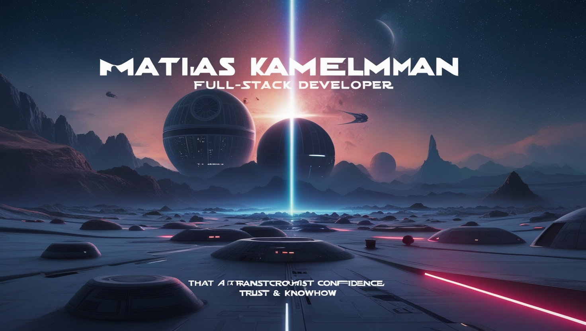

<h2 align="center">Hi there 👋, I'm Matias Kamelman!</h2>
<h3 align="center">A passionate Full Stack Developer with a love for Star Wars, Music, and Technology</h3>

  

---

### 🚀 About Me:
- Full Stack Developer with experience in **JavaScript, React, Python, SQL** and more.
- Background in the **music industry** and **management**, excelling in **team collaboration**, **problem-solving**, and **adaptation** in dynamic environments.
- Passionate about learning, technology, and building innovative solutions to complex problems.
- Always ready to take on new challenges, with a quick learning ability and a **proactive leadership** mindset.

---

### 🛠 Technical Skills:

  
  
  
  
  
  
  
  
  
  

---

### 📫 How to reach me:

  
  
  
  

---

### 📚 Education:
- **2024**: Full Stack Developer, **4Geeks Academy**, Spain
- **1998 - 2001**: Professional Music, **Berklee College of Music**, Buenos Aires, Argentina

---

### 🌍 Languages:
- Spanish – Native
- English – Native
- Catalan – Fluent
- Portuguese – Fluent
- Italian – Fluent
- German – Basic

---

### 🧑‍💻 Currently working on:
- A brainwave entrainment app, **Binaurapp**, improving focus and relaxation using advanced audio technology.
- Building innovative solutions through **React**, **JavaScript**, and **Python**.

---

### ⚡ Fun fact:
When I’m not coding, you’ll find me playing music or binge-watching Star Wars! 

---
